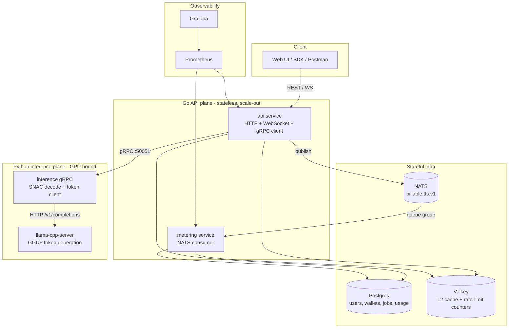
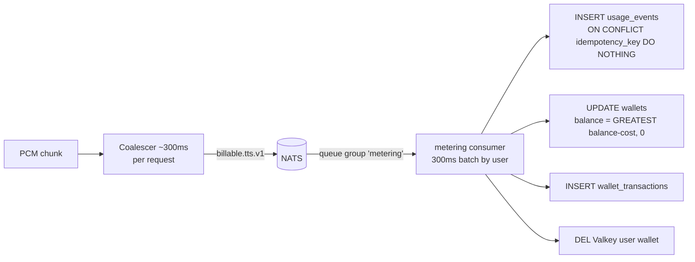

# Orpheus TTS Platform

Go API gateway + metering, Python gRPC inference (Orpheus 3B), Postgres, Valkey, NATS.

**Model (GPU, GGUF):** L40S `lex-au/Orpheus-3b-FT-Q4_K_M.gguf` via llama.cpp
**Audio Decoder:** `hubertsiuzdak/snac_24khz` via standalone python inference server

Input Text becomes a special prompt; Llama-3B autoregressively predicts a stream of custom audio tokens (SNAC codes); a separate SNAC model decodes those codes in 7-token frames into 24 kHz PCM chunks that the API streams to the client.

  Training:     WAV  ──encode──►  SNAC codes  ──map──►  <custom_token_*>  ──►  LLM learns to predict these
  Inference:    text ──►  LLM predicts <custom_token_*>  ──map back──►  SNAC codes  ──decode──►  WAV/PCM
  
So the SNAC decoder at inference is the inverse of the SNAC encoder used when building training data. Same codec, same codebook layout, same 7-token interleaving.

Significance of SNAC in this stack
- Discrete tokens for an LLM 
Llama only predicts discrete token IDs. SNAC turns continuous audio into a finite vocabulary of codes (4096 per level × 3 levels, packed as 7 tokens per frame).

- Streaming-friendly
SNAC is hierarchical: one frame ≈ 7 tokens ≈ ~85 ms of audio. The model can emit tokens left-to-right and decode incrementally (what your speechpipe.py does).

---

### Components


| Plane | Component          | Language | Responsibility                                                                 | Scaling axis                     |
| ----- | ------------------ | -------- | ------------------------------------------------------------------------------ | -------------------------------- |
| Edge  | `api`              | Go       | Auth, rate limit, wallet/admission, billing emit, HTTP/WS fan-out, gRPC client | Stateless → N replicas behind LB |
| Edge  | `metering`         | Go       | Consume billing events, debit wallet, write usage                              | Stateless → N (NATS queue group) |
| GPU   | `inference`        | Python   | SNAC decode, token-stream orchestration, gRPC server                           | N replicas per GPU pool          |
| GPU   | `llama-cpp-server` | C++/CUDA | Autoregressive GGUF token generation                                           | Replicas + nginx LB              |
| Data  | Postgres           | —        | System of record                                                               | Vertical / read replicas         |
| Data  | Valkey             | —        | L2 wallet cache + rate-limit windows                                           | Cluster                          |
| Data  | NATS               | —        | Async billing bus                                                              | Cluster                          |


### Design principles

1. **Separate the CPU-bound control plane (Go) from the GPU-bound data plane (Python).** They scale on different axes and fail independently.
2. **Money is eventually-consistent, delivery is locally-enforced.** The hot path never blocks on a DB write for billing; admission uses a cached balance and a local budget, while the metering service settles the ledger asynchronously.
3. **Backpressure, not degradation.** When the GPU is full, new work queues / 503s instead of dragging every active stream below realtime.
4. **One GPU token backend at a time** (llama.cpp *or* vLLM), but SNAC decoder is always co-resident and independently parallelized.


## Architecture



---

## Data model (Postgres)


| Table                 | Key columns                                                                                     | Purpose                                      |
| --------------------- | ----------------------------------------------------------------------------------------------- | -------------------------------------------- |
| `users`               | `id`, `username`, `password_hash`, `price_per_audio_minute_usd?`                                | Identity + optional per-user price           |
| `wallets`             | `user_id PK`, `balance_usd NUMERIC(14,6)`                                                       | Credit balance (DB default 0; app seeds $20) |
| `wallet_transactions` | `user_id`, `amount_usd`, `reference_id`                                                         | Audit ledger (debits negative)               |
| `api_keys`            | `prefix`, `key_hash`, `revoked_at?`                                                             | SK validation (hash only, never plaintext)   |
| `usage_events`        | `idempotency_key UNIQUE`, `request_id`, `transport`, `audio_seconds`, `cost_usd`, `occurred_at` | Per-request metering ledger                  |
| `tts_jobs`            | `id`, `status`, `input`, `voice`, `audio_data BYTEA`                                            | Async job store                              |
| `user_rate_limits`    | `user_id PK`, `rpm`, `rph`, `rpd`                                                               | Admin overrides                              |


---

## End-to-end sequence (HTTP stream mode)

```mermaid
sequenceDiagram
    participant C as Client
    participant API as api (Go)
    participant VK as Valkey/groupcache
    participant SY as synthlimit
    participant INF as inference (Python gRPC)
    participant L as llama-cpp-server
    participant SNAC as SNAC decoder
    participant N as NATS
    participant M as metering

    C->>API: POST /v1/tts/stream {text, voice}
    API->>API: BearerMiddleware (resolve SK) + rate limit
    API->>VK: HasBalance(user)  (L1→L2→PG)
    API->>SY: Acquire() (admission, MAX_CONCURRENT_SYNTHESIS)
    API->>INF: gRPC Synthesize(request_id, text, voice)
    INF->>L: POST /v1/completions (prompt, stream=true)
    loop token stream
      L-->>INF: <custom_token_N> ...
      INF->>SNAC: every 7 tokens → decode 4-frame window
      SNAC-->>INF: 2048 samples (4096 bytes PCM)
      INF-->>API: AudioChunk{pcm, seq}
      API-->>C: chunked PCM (flush)
      API->>API: budget -= cost; Coalescer.AddPCM
      API-->>N: billable.tts.v1 (~300ms batches)
    end
    API->>SY: Release()
    N-->>M: deliver (queue group)
    M->>M: debit wallet, write usage_events, DEL cache
```

### Latency metrics (TTFB)

`TTFB ≈ prompt eval + first 28 tokens (4 SNAC frames) + first SNAC decode + network`. The decoder withholds output until **28 tokens** (`count > 27`) have arrived, then emits a chunk every **7 tokens**. At ~82 tok/s that first window is ~341 ms of generated codes; measured client TTFB at the realtime operating point is ~0.6 s.

### async vs stream vs live


| Aspect               | **async** `/v1/tts/async`                                    | **stream** `/v1/tts/stream`                       | **live** `/v1/tts/live`                       |
| -------------------- | ------------------------------------------------------------ | ------------------------------------------------- | --------------------------------------------- |
| HTTP shape           | POST → `202 {jobId}`, poll status, GET `/audio`              | Single POST, chunked body                         | WebSocket upgrade (GET)                       |
| gRPC RPC             | `Synthesize` (server-streaming)                              | `Synthesize` (server-streaming)                   | `SynthesizeLive` (bidirectional)              |
| Audio to client      | WAV (assembled server-side, stored in `tts_jobs.audio_data`) | Raw PCM s16le 24 kHz chunks                       | Raw PCM binary WS frames + JSON control       |
| Connection           | Short POST; synthesis in background goroutine                | Held open until EOF                               | Held open until client closes                 |
| Client TTFB          | After job completes + download                               | First flushed PCM byte                            | First binary frame after a `final` utterance  |
| Admission slot       | `Acquire(context.Background())` in worker                    | `Acquire(r.Context())` for whole stream           | `Acquire(r.Context())` before upgrade         |
| `request_id`         | jobID                                                        | new UUID/req                                      | one UUID/session                              |
| Balance refresh      | none (admission snapshot only)                               | every 5 s (`DELIVERY_BALANCE_REFRESH_STREAM_SEC`) | every 2 s (`DELIVERY_BALANCE_REFRESH_WS_SEC`) |
| Insufficient balance | job fails in worker                                          | stream stops (copy error)                         | JSON `insufficient_balance` + WS close 4020   |
| Transport label      | `http_async`                                                 | `http_stream`                                     | `websocket`                                   |
| Best for             | Long text, batch, "fire-and-forget"                          | Low-latency one-shot playback                     | Interactive / incremental typing              |

---

## Metering, wallet & usage tracking (LLD)

### Two-tier wallet cache (groupcache L1 + Valkey L2 + Postgres)

- **L1 = groupcache** (in-process, 64 MiB LRU, singleflight, per-entry 45 s expiry). Keyed by raw user UUID.
- **L2 = Valkey** key `user:{uuid}:wallet` → JSON snapshot, 45 s TTL.
- **Source = Postgres** (`wallets.balance_usd` + `users.price_per_audio_minute_usd`).
- Read path: `Get → L1 → (miss) getter → loadL2OrDB → (miss) Postgres`; `cache_l2_miss_total` increments on L2 misses.
- `Refresh` invalidates L1+L2 and reloads (used periodically during long streams to pick up async debits).

**Why groupcache as L1:** balance is read on *every* admission and refreshed periodically per stream; an in-process LRU with singleflight collapses duplicate loads and keeps the hot path off the network. Valkey provides cross-process sharing; the 45 s TTL + periodic `Refresh` bound staleness. (Single-node L1 today — no distributed peer set wired — so multiple API replicas each keep an independent L1, kept coherent enough by the short TTL and Valkey.)

### Cost model

- **Price:** `users.price_per_audio_minute_usd` if set, else `PLATFORM_DEFAULT_PRICE_PER_MINUTE` (**$0.05/min**).
- **Audio seconds** are derived from delivered PCM bytes, so users pay for *delivered* audio.

### Billing pipeline (async, idempotent)



- The **Coalescer** (one per request) accumulates PCM-derived seconds and flushes every `BILLING_COALESCE_MS` (300 ms) plus a final flush
- The **metering** service `QueueSubscribe` (queue group → horizontally scalable, at-most-once delivery per message), batches per user every 300 ms, then **recomputes cost** `audio_seconds × price`

### Delivery budget (synchronous safety)

Independent of async billing, each stream keeps a **local budget** seeded from the cached balance and decremented per chunk; when it hits zero the stream stops (HTTP error / WS `insufficient_balance` + close 4020). Periodic `Refresh` re-syncs the budget from the ledger. This guarantees we stop delivering near the credit limit even though debits settle asynchronously (DB balance never goes negative; small over-delivery is bounded by the refresh interval).

---

## Rate Limiting

1. **Load caps (config keys)**  
   Read `rlcfg:{userId}` from Valkey — JSON like `{"rpm":60,"rph":1000,"rpd":10000}`.  
   If missing → Postgres `user_rate_limits` → else env defaults.

2. **Count this request (counter keys)**  
   Build three keys from current UTC time buckets and `INCR` each in one pipeline:
   - `rl:{userId}:m:{unix/60}` — requests this **minute**
   - `rl:{userId}:h:{unix/3600}` — requests this **hour**
   - `rl:{userId}:d:{unix/86400}` — requests this **day**  
   Set TTL on each key (minute ≈ 2 min, hour ≈ 2 h, day ≈ 2 days).

3. **Check limits**  
   If any counter **>** its cap (e.g. `rl:alice:m:29219437` = 61 and RPM = 60) → **429** + `Retry-After`.

4. **Allow**  
   If all three counters are within limits → continue to the API handler.

---

## Observability

### Metrics (Prometheus, scraped from `api:8080` and `metering:8081`)


| Metric                                                            | Type      | Labels                    | Requirement                      |
| ----------------------------------------------------------------- | --------- | ------------------------- | -------------------------------- |
| `tts_time_to_first_byte_seconds`                                  | Histogram | `transport`               | **TTFB**                         |
| `tts_request_duration_seconds`                                    | Histogram | `route`,`transport`       | **API latency**                  |
| `tts_realtime_factor`                                             | Histogram | `transport`               | **RTF**                          |
| `tts_active_streams`                                              | Gauge     | —                         | **Realtime concurrency**         |
| `tts_audio_seconds_generated_total`                               | Counter   | `transport`               | Throughput / billing cross-check |
| `http_request_duration_seconds`                                   | Histogram | `method`,`route`,`status` | API latency                      |
| `cache_l2_miss_total`                                             | Counter   | —                         | Cache efficiency                 |
| `wallet_balance_usd`                                              | Gauge     | `user_id`                 | Wallet (opt-in)                  |
| `metering_events_processed_total` / `metering_debit_errors_total` | Counter   | —                         | Billing health                   |


- **RTF** is computed per request/utterance as `processing_seconds / audio_seconds`; `< 1` = realtime.
- **Active streams** is incremented/decremented around every synthesis (`TrackActiveStream`) across all three modes, giving live concurrency.

---

## Optimizations — done & proposed

### Implemented

- **Two-tier wallet cache** (groupcache L1 + Valkey L2) with singleflight — removes Postgres from the admission hot path.
- **Vectorized SNAC decode** (batched tensor reshape vs per-frame Python loop) + **per-thread CUDA streams** for concurrent decode.
- **Async, coalesced, idempotent billing** (300 ms windows on both API and metering) — minimizes NATS/DB load.
- **gRPC round-robin** across SNAC replicas; **nginx least_conn** for llama replicas.
- **q8_0 KV cache** + **derived ctx** (parallel × 4096) — VRAM efficiency without truncation or quality loss.
- **Admission control at the measured realtime ceiling** — protects in-flight RTF.
- **Long-text sentence batching + crossfade stitching** — unbounded input length without truncation or seams.

### Proposed (highest leverage first)

1. **Dedicated SNAC GPU** (or a 2nd GPU): remove the llama↔SNAC contention identified in §10.5 — expected to roughly double the realtime ceiling.
2. **Batched SNAC decode across concurrent streams**: amortize the decode tax (~1.17×) → ~7–8 streams on the current single GPU.
3. **Horizontal GPU scale-out**: replicate the whole GPU plane behind the existing round-robin; the Go edge already supports it.
4. **Distributed groupcache peers** (wire `HTTPPool`/`SetPeers`) once the API runs multiple replicas, for cross-node L1 coherence.
5. **Speculative / smaller-draft decoding** or a continuous-batching engine tuned for low per-stream latency, to lift the per-sequence 82-tok/s ceiling.
6. **Prefill caching** for common prompt prefixes/voices to shave TTFB.

---